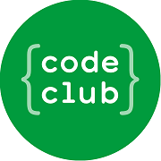

# Moonhack 2023
 
 

## Algemeen
Hier vind je de [startpagina](https://moonhack.com/) van Moonhack 2023 (in het Engels) 
Hier vind je de [projectenpagina](https://moonhack.com/projects) van Moonhack 2023 (in het Engels)
Moonhack 2023 wordt georganiseerd door [Code Club Australië](https://codeclubau.org/)

## Scratch-projecten
### Ruimteschoen
Je gaat een spel maken waarin de gebruiker zijn eigen stijl ruimteschoen kan ontwerpen. 
Niveau: eenvoudig 
[De pagina van dit project (in het Engels)](https://codeclubau.org/projects/space-shoe/) 
[De opdracht (PDF-bestand)](https://assets.codeclubau.org/assets/Dutch_SpaceShoes_2023-08-28-234638.pdf?mtime=20230829094638&focal=none) 
[Het offline startproject (sb3-bestand)](resources/SpaceShoeStarter-MH23.sb3) 
[Het online startproject](https://scratch.mit.edu/projects/887029903/)

### In de ruimte kijken
Je gaat een spel maken waarbij de gebruiker verborgen voorwerpen in de ruimte kan vinden. 
Niveau: gemiddeld 
[De pagina van dit project (in het Engels)](https://codeclubau.org/projects/looking-into-space/) 
[De opdracht (PDF-bestand)](https://assets.codeclubau.org/assets/Dutch_LookingintoSpace_2023-08-28-234750.pdf?mtime=20230829094750&focal=none) 
[Het offline startproject (sb3-bestand)](resources/LookingIntoSpace-MH23.sb3) 
[Het online startproject](https://scratch.mit.edu/projects/887032487/)

### Bescherm onze planeet
Je gaat een spel maken waarbij de gebruiker op sterren richt en schiet om de planeet te beschermen. 
Niveau: gemiddeld 
[De pagina van dit project (in het Engels)](https://codeclubau.org/projects/protect-the-planet/) 
[De opdracht (PDF-bestand)](https://assets.codeclubau.org/assets/Dutch_ProtectthePlanet_2023-08-28-234253.pdf?mtime=20230829094253&focal=none) 
[Het offline startproject (sb3-bestand)](resources/ProtectThePlanet-MH23.sb3) 
[Het online startproject](https://scratch.mit.edu/projects/887033103/)

## micro:bit-project
### Sterrenbeeld
Programmeer verschillende micro:bits als fonkelende sterren en maak je eigen sterrenbeeld. 
Niveau: gemiddeld 
[De pagina van dit project (in het Engels)](https://codeclubau.org/projects/constellation/) 
[De opdracht (PDF-bestand)](https://assets.codeclubau.org/assets/Dutch_Constellation.pdf?mtime=20230825185835&focal=none)

## Python-project
### Raad de uitvinding
Je schrijft een programma voor een spel, vergelijkbaar met galgje, waarbij de gebruiker letters voorstelt om een woord te raden dat een uitvinding is die voor de ruimte is gemaakt. 
Niveau: eenvoudig 
[De pagina van dit project (in het Engels)](https://codeclubau.org/projects/guess-the-invention/) 
[De opdracht (PDF-bestand)](https://assets.codeclubau.org/assets/Dutch_GuesstheInvention.pdf?mtime=20230825190012&focal=none)

## Speciaal project
### Ruimteafval
Kun je een idee delen om het probleem van ruimteafval op te lossen? Dit project kun je met Scratch doen, maar ook met bijvoorbeeld Python of HTML. 
Niveau: alle 
[De pagina van dit project (in het Engels)](https://codeclubau.org/projects/space-junk/) 
[De opdracht (PDF-bestand)](https://assets.codeclubau.org/assets/Dutch_SpaceJunk_2023-08-28-234458.pdf?mtime=20230829094458&focal=none) 
[Het offline startproject (sb3-bestand)](resources/SpaceJunkStarter-MH23.sb3) 
[Het online startproject](https://scratch.mit.edu/projects/887033842)

